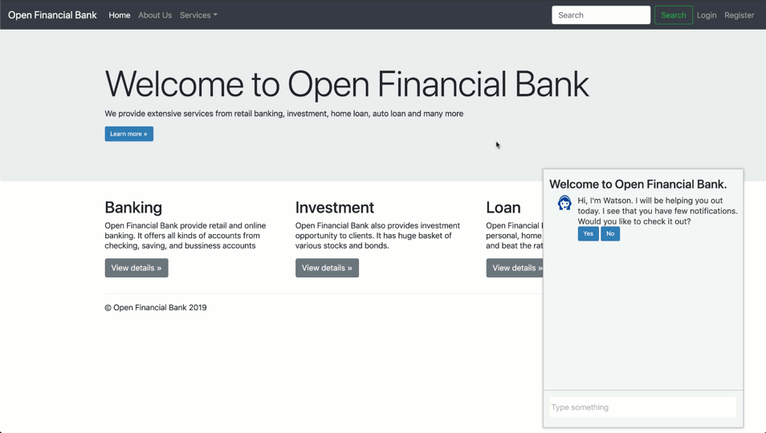

> Watson Conversation is now Watson Assistant. Although some images in this code pattern may show the service as Watson Conversation, the steps and processes will still work.

# Create a banking chatbot with FAQ discovery, anger detection and natural language understanding

In this code pattern, we will create a chatbot using Node.js and Watson Assistant. The Assistant flow will be enhanced by using Natural Language Understanding to identify entities and using Tone Analyzer to detect customer emotions. For FAQs, a call to the Discovery service will use passage retrieval to pull answers from a collection of documents.

When the reader has completed this pattern, they will understand how to:

* Create a chatbot that converses via a web UI using Watson Assistant and Node.js
* Use Watson Discovery with passage retrieval to find answers in FAQ documents
* Use Watson Tone Analyzer to detect emotion in a conversation
* Identify entities with Watson Natural Language Understanding

## Flow

1. The FAQ documents are added to the Discovery collection.
2. The user interacts with a chatbot via the app UI.
3. User input is processed with Tone Analyzer to detect anger. An anger score is added to the context.
4. User input is processed with Natural Language Understanding (NLU). The context is enriched with NLU-detected entities and keywords (e.g., a location).
5. The input and enriched context is sent to Assistant. Assistant recognizes intent, entities and dialog paths. It responds with a reply and/or action.
6. Optionally, a requested action is performed by the app. This may include one of the following:
   * Lookup additional information from bank services to append to the reply
   * Use Discovery to reply with an answer from the FAQ documents

## Included components

* [IBM Watson Assistant](https://www.ibm.com/cloud/watson-assistant/): Build, test and deploy a bot or virtual agent across mobile devices, messaging platforms, or even on a physical robot.
* [IBM Watson Discovery](https://www.ibm.com/watson/services/discovery/): A cognitive search and content analytics engine for applications to identify patterns, trends, and actionable insights.
* [IBM Watson Natural Language Understanding](https://www.ibm.com/watson/services/natural-language-understanding/): Analyze text to extract meta-data from content such as concepts, entities, keywords, categories, sentiment, emotion, relations, semantic roles, using natural language understanding.
* [IBM Watson Tone Analyzer](https://www.ibm.com/watson/services/tone-analyzer/): Uses linguistic analysis to detect communication tones in written text.

## Featured technologies

* [Node.js](https://nodejs.org/): An asynchronous event driven JavaScript runtime, designed to build scalable applications.

### Deployment options

| Cloud Foundry | OpenShift | Local |
| :-: | :-: | :-: |
|  |  |  |

## Sample output

## Troubleshooting

* Fail: An operation for service instance wbc-discovery-service is in progress.

  > This error occurs when starting the app before the service is ready. It is currently common behavior with the `Deploy to IBM Cloud` button. In this case, click the `Run` button to restart the application. It will succeed when the service is ready.

* Error: Environment {GUID} is still not active, retry once status is active

  > This is common during the first run. The app tries to start before the Discovery environment is fully created. Wait a few minutes and click the `Run` button to restart the application.

* Error: Only one free environment is allowed per organization

  > To work with a free trial, a small free Discovery environment is created. If you already have a Discovery environment, this will fail. If you are not using Discovery, check for an old service thay you may want to delete. Otherwise use the .env DISCOVERY_ENVIRONMENT_ID to tell the app which environment you want it to use. A collection will be created in this environment using the default configuration.

## Links

* [Demo on Youtube](https://www.youtube.com/watch?v=Jxi7U7VOMYg)
* [Watson Node.js SDK](https://github.com/watson-developer-cloud/node-sdk)
* [Relevancy Training Demo Video](https://www.youtube.com/watch?v=8BiuQKPQZJk)
* [Relevancy Training Demo Notebook](https://github.com/akmnua/relevancy_passage_bww)

## License

This code pattern is licensed under the Apache License, Version 2. Separate third-party code objects invoked within this code pattern are licensed by their respective providers pursuant to their own separate licenses. Contributions are subject to the [Developer Certificate of Origin, Version 1.1](https://developercertificate.org/) and the [Apache License, Version 2](https://www.apache.org/licenses/LICENSE-2.0.txt).

[Apache License FAQ](https://www.apache.org/foundation/license-faq.html#WhatDoesItMEAN)
